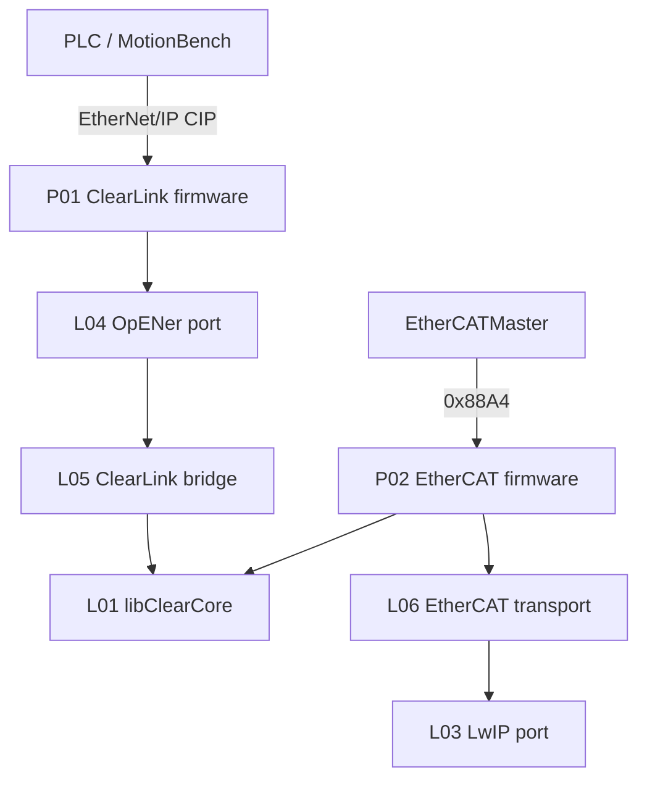

# System overview

ClearCore Motion Stack hosts two firmware personalities plus Windows host tools on shared ClearCore libraries.

## Startup order

### ClearLink-compat (P01)

1. USB open / banner  
2. Wait Ethernet link (`EthernetMgr.PhyLinkActive`)  
3. `EthernetMgr.Setup()`  
4. `opener_init(netif)` (L04)  
5. Loop: `EthernetMgr.Refresh` + `opener_cyclic` (~1 ms)

### EtherCAT personality (P02)

1. Ethernet bring-up  
2. `EthercatSlaveInit` (L06)  
3. Loop: apply command image → sample I/O → fill status → transport cyclic / Ethernet service → ~1 ms delay

## Data flows

## Configuration persistence

| Item | Where | Notes |
|------|-------|-------|
| OpENer TCP/IP object | OpENer NVM/path per port | Applied at opener_init |
| Board mode 0x69 | RAM today | NVRAM optional future (OPEN_QUESTIONS) |
| EtherCAT PDO | Fixed in firmware/ESI | Not runtime remapped by app |

## Source evidence

| Claim | Evidence | Level |
|-------|----------|-------|
| P01 opener bring-up | `ClearLinkCompatibilityFirmware/main.cpp` | E1 |
| Dual personalities | root `README.md` EtherCAT + EIP sections | E1 |
