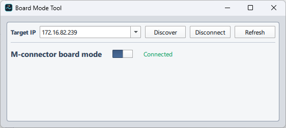
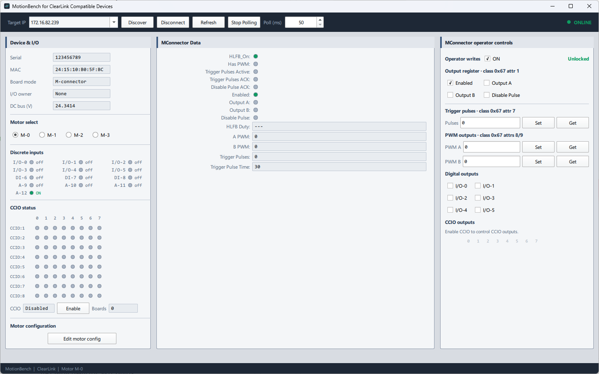
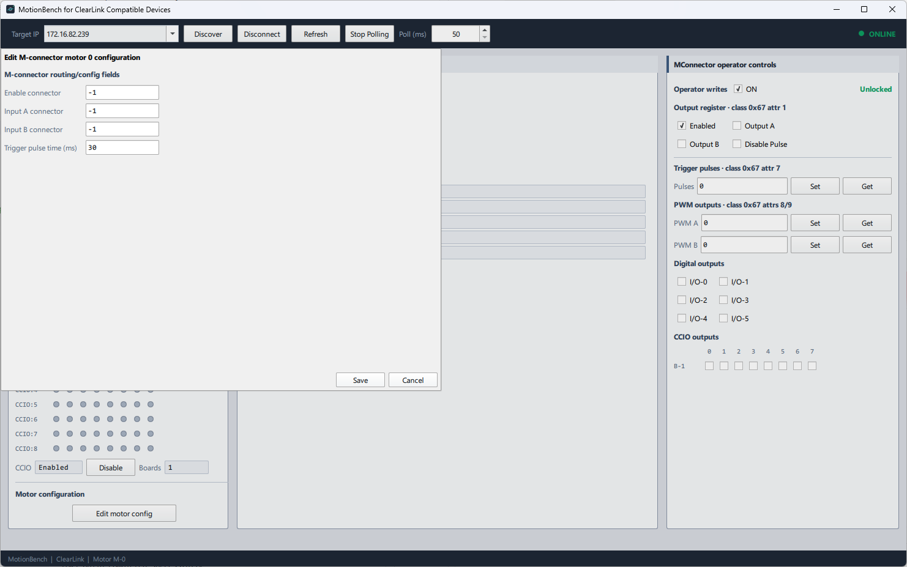
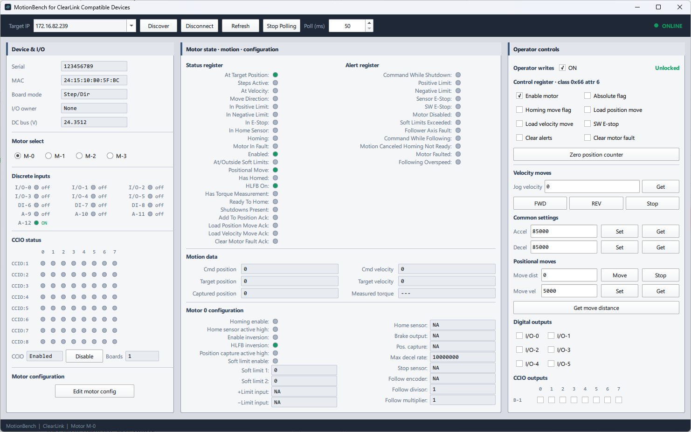
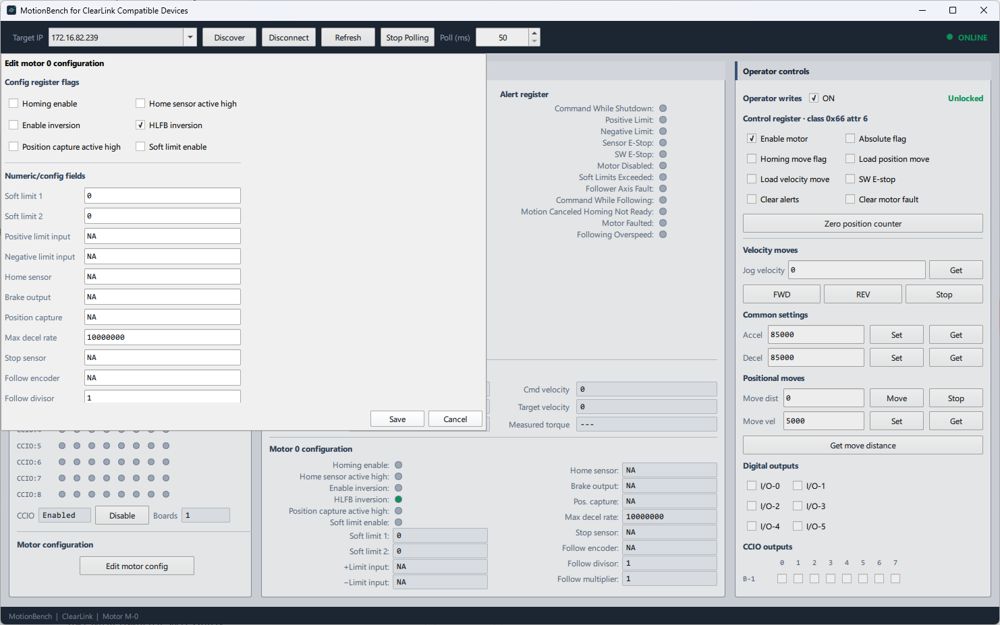

# MotionBench

MotionBench is a Qt Quick/QML Win32 operator tool for monitoring and commanding ClearLink Compatiable devices over EtherNet/IP explicit messaging.

It is built for bench validation: discover devices, connect to a target IP, monitor motor and I/O telemetry, issue operator commands, and tune motor/board behavior from one UI.

## What MotionBench Includes

- Device discovery and direct connect/disconnect workflow.
- Persistent target IP and operator write-lock settings.
- Polling-based live monitoring with status/alert/motion views.
- Step/Dir and M-connector mode handling with mode-aware UI.
- Integrated digital output controls and CCIO status/output controls.
- External scanner ownership awareness that blocks operator writes when I/O is owned elsewhere.

## Screenshots (Provided By User)

### BoardModeTool



### MotionBench - M-connector mode



### MotionBench - M-connector motor configuration dialog



### MotionBench - Step/Dir mode



### MotionBench - Step/Dir motor configuration dialog



## Build Requirements

- CMake 3.21+
- Qt 6.5+ (`Core`, `Quick`, `Qml`, `Network`)
- MSVC toolchain on Windows

## Configure and Build

```powershell
cmake -S MotionBench -B MotionBench/build -G "Visual Studio 17 2022" -A x64
cmake --build MotionBench/build --config Release
```

Alternative helper script:

```powershell
MotionBench\build_vs.cmd Release
```

## Runtime Deployment (`windeployqt`)

- Deployment wiring is in `MotionBench/cmake/DeployQt.cmake`.
- Post-build steps run `windeployqt` to stage required Qt DLLs, plugins, and QML runtime files beside the executable.
- To override auto-discovery of `windeployqt`:

```powershell
cmake -S MotionBench -B MotionBench/build -DWINQTDEPLOY_EXECUTABLE="C:/Qt/6.8.0/msvc2022_64/bin/windeployqt.exe"
```

## Related Documentation

- Object/class/instance map: `MotionBench/docs/CLEARLINK_OBJECT_MAP.md`
- Service/UI architecture: `MotionBench/docs/ARCHITECTURE.md`
- Validation checklist: `MotionBench/docs/VALIDATION.md`
